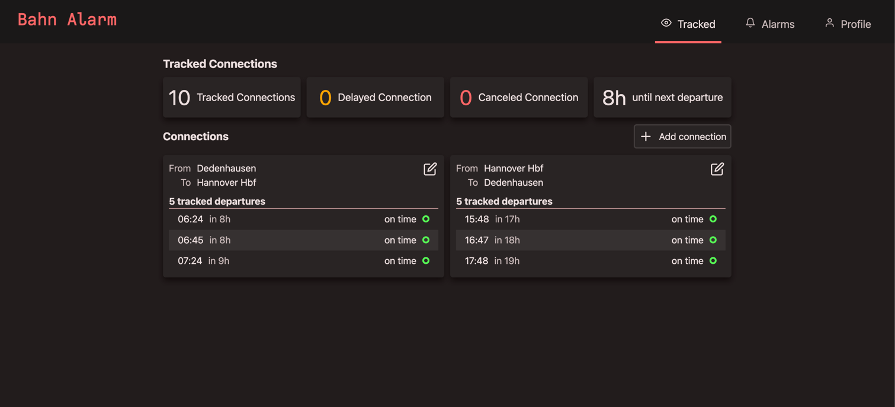
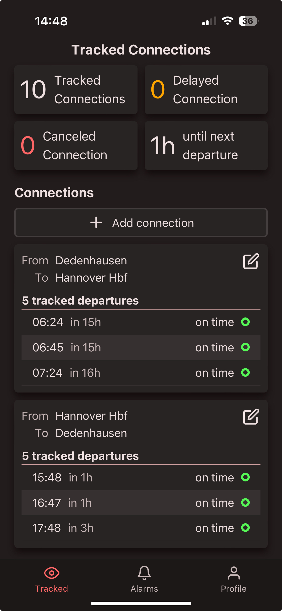

<p align="center">
    
</p>

Bahn alarm is a pet project of mine that sends real-time notifications about train delays from the Deutsche Bahn.
It does this by regularly polling the API of the new "Next DB Navigator" app.

**I am by no means affiliated with the DB. This project was built for educational purposes only.**


<details>
  <summary>Screenshots</summary>

  <h3>Desktop</h3>
  

  <h3>Mobile</h3>
  
</details>

## Tech stack

- Angular frontend
  - PNPM as a package manager
  - HSL color scheme based on [web.dev - Color schemes with HSL](https://web.dev/patterns/theming/)
  - Web push API notifications
- Go backend
  - Cobra for handling the different management commands
  - Echo as a server
  - sqlx and squirrel for interacting with postgres
  - goose for migrations
- Postgres
- Kubernetes with traefik
- Prometheus for metrics

## Developing locally

### Frontend

```bash
# Install pnpm if you don't have it yet
npm i -g pnpm

cd frontend
pnpm install

pnpm start
```

### Backend

```bash
docker compose up -d

cd backend
CONFIGOR_ENV=dev go run . serve
```